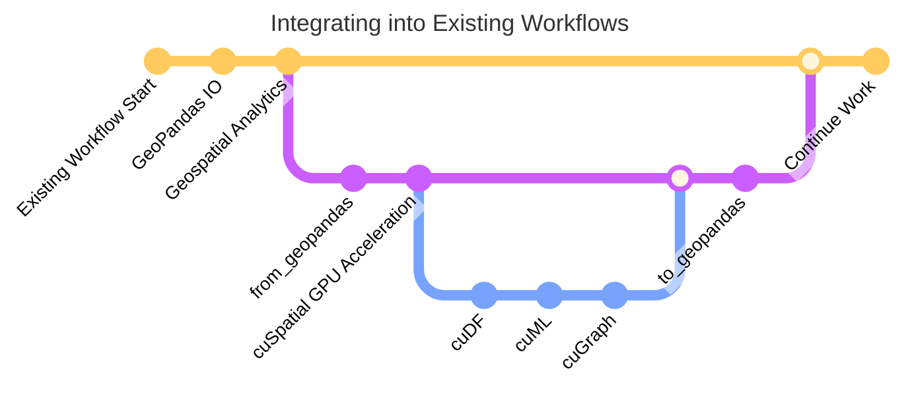

> [!IMPORTANT]  
> qu-spatial is a community-driven fork of NVIDIA RAPIDS cuSpatial. The upstream cuSpatial project sunset with release `v25.04`. See https://docs.rapids.ai/notices/rsn0045/ for the official announcement.

# qu-spatial – GPU-Accelerated Vector Geospatial Data Analysis

qu-spatial continues the cuSpatial codebase with a renewed focus on geospatial workflows that pair tightly with QGIS integration while retaining first-class Python support. We will keep tracking RAPIDS core libraries—[cuDF](https://github.com/rapidsai/cudf), [RMM](https://github.com/rapidsai/rmm), and companions such as [cuML](https://github.com/rapidsai/cuml) and [cuGraph](https://github.com/rapidsai/cugraph)—as we evolve the project.

> **Note**
>
> During this transition period, we still reference the upstream cuSpatial documentation set for installation, API details, and developer guides. Expect qu-spatial specific docs and QGIS plugin guidance to land incrementally.

## Acknowledgements

We are deeply grateful to the RAPIDS cuSpatial team for the years of GPU geospatial innovation and for continuing to maintain the foundational libraries we depend on. This fork aims to honor and extend that work while exploring new integration paths with the broader open geospatial community.

## Project Direction

- Sustain and extend the cuSpatial APIs to keep GPU-accelerated vector analytics productive for Python users.
- Develop and maintain a qu-spatial QGIS plugin that brings GPU acceleration directly into desktop GIS workflows.
- Preserve compatibility with RAPIDS ecosystem libraries while opening the door to additional community contributions and packaging options.

## Resources

Until the qu-spatial documentation site is in place, please continue to rely on the upstream cuSpatial resources:

- [cuSpatial User's Guide](https://docs.rapids.ai/api/cuspatial/stable/user_guide/cuspatial_api_examples.html): Python API reference and guides
- [cuSpatial Developer Documentation](https://docs.rapids.ai/api/cuspatial/stable/developer_guide/index.html): Understand cuSpatial's architecture
- [Getting Started](https://docs.rapids.ai/install#selector): Installation options for cuSpatial
- [cuSpatial Community](https://github.com/rapidsai/cuspatial/discussions): Get help, collaborate, and ask questions (the upstream team still monitors this forum)
- [cuSpatial Issues](https://github.com/rapidsai/cuspatial/issues/new/choose): Request features/documentation or report upstream bugs

For qu-spatial specific questions or contributions, open an issue or discussion in this repository.

## Overview
cuSpatial accelerates vector geospatial operations through GPU parallelization. qu-spatial inherits those capabilities and will layer QGIS desktop integration and community-driven packaging on top. As part of the RAPIDS libraries, cuSpatial is inherently connected to [cuDF](https://github.com/rapidsai/cudf), [cuML](https://github.com/rapidsai/cuml), and [cuGraph](https://github.com/rapidsai/cugraph), enabling GPU acceleration across entire workflows.

cuSpatial represents data in [GeoArrow](https://github.com/geoarrow/geoarrow) format, which enables compatibility with the [Apache Arrow](https://arrow.apache.org) ecosystem.

cuSpatial's Python API is closely matched to GeoPandas and data can seamlessly transition between the two:
```python
import geopandas
from shapely.geometry import Polygon
import cuspatial

p1 = Polygon([(0, 0), (1, 0), (1, 1)])
p2 = Polygon([(0, 0), (1, 0), (1, 1), (0, 1)])
geoseries = geopandas.GeoSeries([p1, p2])

cuspatial_geoseries = cuspatial.from_geopandas(geoseries)
print(cuspatial_geoseries)
```
Output:
```
0    POLYGON ((0 0, 1 0, 1 1, 0 0))
1    POLYGON ((0 0, 1 0, 1 1, 0 1, 0 0))
```

For additional examples, browse the complete [API documentation](https://docs.rapids.ai/api/cuspatial/stable/), or check out more detailed [notebooks](https://github.com/rapidsai/notebooks-contrib). the [NYC Taxi][1] and [Weather][2] notebooks make use of cuSpatial. qu-spatial specific notebooks will live in this repository as they are developed.

## Supported Geospatial Operations

### Core Spatial Functions
- [Spatial relationship queries (DE-9IM)](https://docs.rapids.ai/api/cuspatial/stable/api_docs/geopandas_compatibility/#cuspatial.GeoSeries.contains)
- [Linestring-Linestring Intersections](https://docs.rapids.ai/api/cuspatial/stable/user_guide/cuspatial_api_examples.html#Linestring-Intersections)
- Cartesian distance between any two geometries (ST_Distance)
- [Haversine distance](https://docs.rapids.ai/api/cuspatial/stable/user_guide/cuspatial_api_examples.html#cuspatial.haversine_distance)
- [Hausdorff distance](https://docs.rapids.ai/api/cuspatial/stable/user_guide/cuspatial_api_examples.html#cuspatial.directed_hausdorff_distance)
- [Spatial window filtering](https://docs.rapids.ai/api/cuspatial/stable/user_guide/cuspatial_api_examples.html#cuspatial.points_in_spatial_window)

### Indexing and Join Functions
- [Quadtree indexing](https://docs.rapids.ai/api/cuspatial/stable/user_guide/cuspatial_api_examples.html#Quadtree-Indexing)
- [Spatial joins](https://docs.rapids.ai/api/cuspatial/stable/user_guide/cuspatial_api_examples.html#Indexed-Spatial-Joins)
- [Quadtree-based point-in-polygon](https://docs.rapids.ai/api/cuspatial/stable/user_guide/cuspatial_api_examples.html#cuspatial.quadtree_point_in_polygon)
- [Quadtree-based point-to-nearest-linestring](https://docs.rapids.ai/api/cuspatial/stable/user_guide/cuspatial_api_examples.html#cuspatial.quadtree_point_to_nearest_linestring)

### Trajectory Functions
- [Deriving trajectories from point location data](https://docs.rapids.ai/api/cuspatial/stable/user_guide/cuspatial_api_examples.html#cuspatial.derive_trajectories)
- [Computing distance/speed of trajectories](https://docs.rapids.ai/api/cuspatial/stable/user_guide/cuspatial_api_examples.html#cuspatial.trajectory_distances_and_speeds)
- [Computing spatial bounding boxes of trajectories](https://docs.rapids.ai/api/cuspatial/stable/user_guide/cuspatial_api_examples.html#cuspatial.trajectory_bounding_boxes)

### What if operations I need aren't supported?
Thanks to the `from_geopandas` and `to_geopandas` functions you can accelerate what cuSpatial supports, and leave the rest of the workflow in place.




## Using qu-spatial

Until we publish refreshed qu-spatial installers, please follow the upstream cuSpatial installation paths below. New packaging targets (Conda Forge, wheels, and QGIS bundles) will be announced in this repository.
**CUDA/GPU requirements**
- CUDA 11.8+ with a [compatible, supported driver](https://docs.nvidia.com/datacenter/tesla/drivers/#cuda-drivers)
- Volta architecture or newer ([Compute Capability >=7.0](https://developer.nvidia.com/cuda-gpus))

### Build/Install from source

To start, qu-spatial will need to be built from source. Detailed steps to follow soon as we transition to uv-based installs.

## Quick build with uv (Linux x86_64, CUDA 12)

The fastest way to get going is to use prebuilt RAPIDS wheels and uv for environment management:

```bash
# 1) Create venv
uv venv --python 3.12
source .venv/bin/activate

# 2) Install runtime dependencies from NVIDIA's PyPI index
uv add --extra-index-url=https://pypi.nvidia.com \
   cudf-cu12 cuspatial-cu12 rmm-cu12 cupy-cuda12x geopandas numpy

# 3) Optional: build project wheels from source
#   - Build core C++ library wheel
cd python/libcuspatial && uv build && cd -
#   - Install it, then build Python bindings against it
uv pip install python/libcuspatial/dist/libcuspatial-*.whl
cd python/cuspatial && uv build && cd -

# 4) Install your freshly built wheels
uv pip install python/cuspatial/dist/cuspatial-*.whl
```

See `docs/source/developer_guide/build.md` for a detailed guide and troubleshooting.


[1]:https://github.com/rapidsai-community/notebooks-contrib/blob/main/community_tutorials_and_guides/taxi/NYCTaxi-E2E.ipynb
[2]:https://github.com/rapidsai-community/notebooks-contrib/blob/main/community_tutorials_and_guides/weather.ipynb
